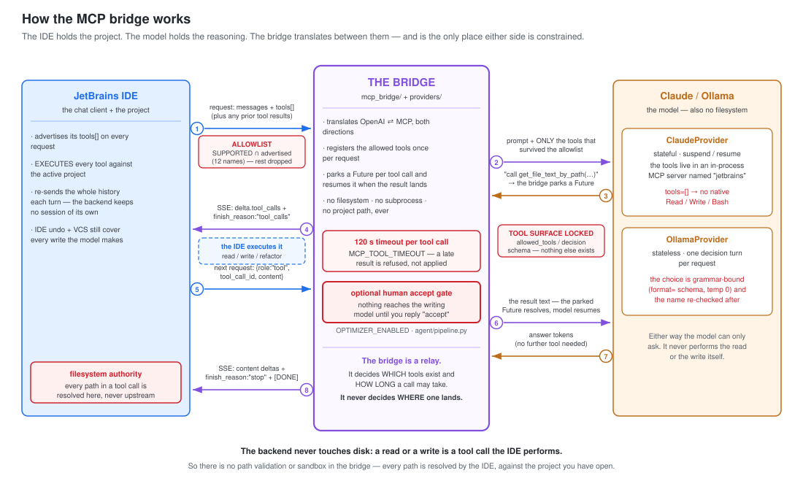
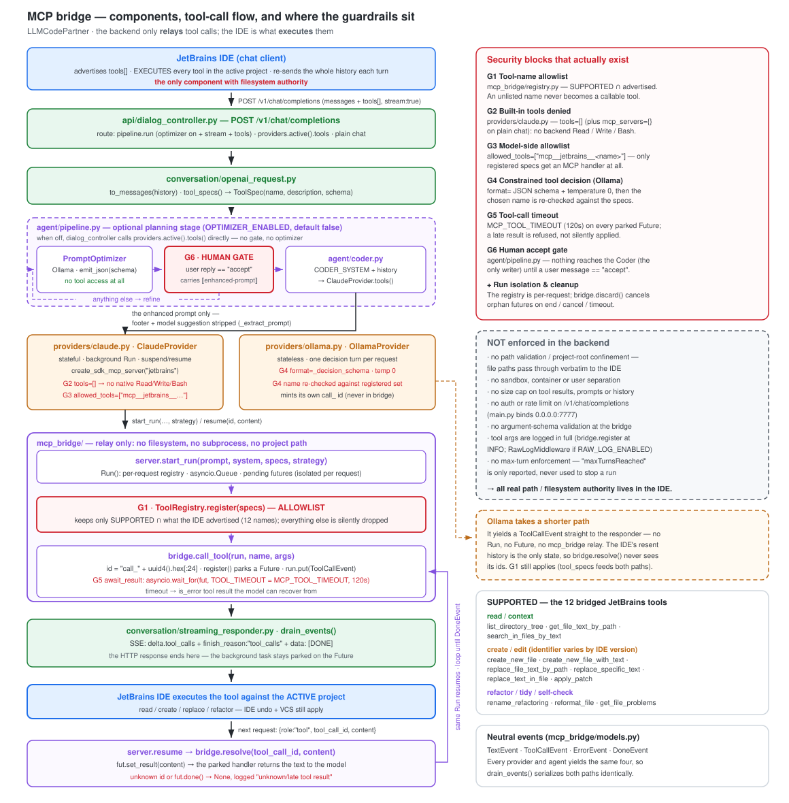
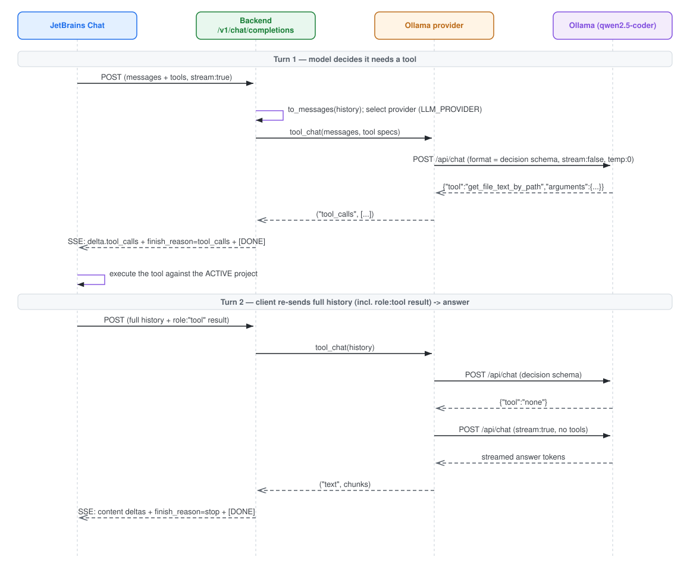

# LLMCodePartner

A minimal FastAPI backend that exposes an **OpenAI-compatible** API
(`POST /v1/chat/completions`, `GET /v1/models`) and bridges it to a **local
Claude/Codex** via the Claude Agent SDK (uses the installed `claude` CLI's
login — no `ANTHROPIC_API_KEY` required). The coder can both **read and edit**
the active JetBrains project through the IDE's own tools (see below).

Run it:

```bash
uv run main.py          # serves on http://0.0.0.0:7777
```

### Docker Compose

The Compose image includes Python 3.13, Node.js 22, and pinned OpenSpec, Codex,
and Claude Code CLIs. Copy `.env.example` to `.env`, adjust the provider settings,
then build and start the service:

```bash
cp .env.example .env
docker compose build
docker compose up -d
docker compose ps
```

The API is available at `http://localhost:7777`; its health check calls
`GET /v1/models`. Verify the packaged tools with:

```bash
docker compose exec codepartner openspec --version
docker compose exec codepartner codex --version
docker compose exec codepartner claude --version
```

### Task model routing

OpenSpec tasks can be executed explicitly with `/run WP1-T1`. The task's
complexity selects a configured candidate pool, vLLM Semantic Router recommends
one allowed model, and Code Partner starts Claude Code or Codex with the existing
JetBrains MCP tool bridge. agentgateway is attempted where the authenticated CLI
flow supports it, with direct CLI fallback retained. See
[model routing](docs/model-routing.md) for configuration and fallback behavior.

Claude and Codex credentials live in the named `agent-home` volume mounted at
`/home/codepartner`. Authenticate each provider once inside the container. Device
authentication is the recommended Codex flow for remote or headless machines:

```bash
docker compose run --rm codepartner claude auth login
docker compose run --rm codepartner codex login --device-auth
```

Verify both logins before starting the service:

```bash
docker compose run --rm codepartner claude auth status
docker compose run --rm codepartner codex login status
```

If Codex reports `Permission denied` while logging in after upgrading from an
older image, repair the existing credential directory once, then retry:

```bash
docker compose run --rm --user root codepartner \
  chown -R codepartner:codepartner /home/codepartner/.codex
```

Codex device authentication may need to be enabled in your ChatGPT security
settings or by your workspace administrator. Open the displayed URL in a browser
and enter the one-time code; do not share that code. The named volume remains after
container replacement and `docker compose down`, so refreshed credentials and CLI
settings survive rebuilds. `docker compose down -v` intentionally deletes that
volume and requires signing in again. The service runs as the non-root
`codepartner` user so the credential store remains writable.

Compose uses host networking because PyCharm's MCP server listens only on host
loopback. The API therefore listens directly on host port 7777 even though
`docker compose ps` does not display a published-port mapping. `OLLAMA_HOST`,
`MCP_PUBLIC_BASE`, and `JETBRAINS_MCP_URL` can all use `127.0.0.1` from the
container. No source project is mounted: the backend writes complete
`openspec/changes/` artifacts plus the `.codepartner/` catalog and dashboard
through PyCharm's MCP server in the configured active project.

For unattended deployments, provide `ANTHROPIC_API_KEY` or the applicable Codex
access token through a secret manager or runtime environment. Never copy credentials
into the image. `.dockerignore` excludes the local `.env` file.

- Capability diagnostics log tool names, schema-shape decisions, and call IDs only.
  Request bodies, prompts, credentials, and tool arguments are never logged.
- Tool-call timeout: `.env` `MCP_TOOL_TIMEOUT=120` (seconds).
- LLM provider: `.env` `LLM_PROVIDER=claude|codex|ollama` (see Providers).
- Coder provider: `.env` `CODER_PROVIDER=claude|codex` — who executes the accepted
  prompt in the pipeline, independent of `LLM_PROVIDER`.
- Ollama model: `.env` `OLLAMA_MODEL` (and `OLLAMA_HOST`).
- Prompt-optimizer pipeline (opt-in): `.env` `OPTIMIZER_ENABLED=true`; the
  optimizer may run on a sturdier instruction-follower via `OPTIMIZER_MODEL`
  (defaults to `OLLAMA_MODEL`). See **Prompt-optimizer pipeline**.

## OpenSpec planning commands

Send `/spec <request>` through the chat endpoint to create a new, additive
OpenSpec change without starting implementation:

```text
/spec "implement authentication"
```

Each invocation creates a separate directory under `openspec/changes/` containing
`.openspec.yaml`, `proposal.md`, `design.md`, one or more capability delta
specifications, and `tasks.md`. A later `/spec` creates another change and never
replaces an earlier one.

The provider groups related work into one or more purpose-oriented work packages.
The backend assigns globally stable IDs such as `WP1`, `WP1-T1`, and
`WP1-T2`; IDs come from the backend catalog rather than model output. Work
packages may be user stories, technical outcomes, migrations, refactorings,
research, or operational work. Every task retains its title, description,
complexity, reasoning, context, and preferred capability.

`.codepartner/spec-index.json` stores the machine-readable catalog and
`.codepartner/tasks.md` is regenerated as a dashboard of every active work
package. The OpenSpec change files remain the planning artifacts.

Refine selected tasks with `/update`:

```text
/update WP1-T1 WP1-T2: replace polling with event callbacks
```

Implement persisted tasks with the model-routing pipeline:

```text
/implement WP1-T1
/implement WP1
/execute WP1 WP3-T2
/implement WP1-T1: add MLflow tracking and keep the configuration injectable
```

`/implement` is the canonical command; `/execute` is an alias. A work-package
selector expands to its incomplete tasks in order. Optional execution guidance
must follow a colon, so task selection remains unambiguous. The backend creates a durable
implementation job, routes each task only when it starts, and executes tasks
sequentially. A failed task stops the job; completed tasks are checked off in the
OpenSpec change and dashboard. IDE tool calls pause the current task and resume
that same routed provider before the job advances.

`/implement` and `/run` use only source-write tools advertised by the calling IDE
through the bridge. Code Partner never stores a PyCharm MCP URL or a project path,
so one container can serve multiple projects without a fixed-project fallback. A
task is never marked complete from a chat-only response: it must receive a
successful IDE mutation result. `/review` remains read-only, while `/spec`,
`/update`, and `/rework` only persist their own OpenSpec artifacts and never grant
an LLM source-write tools.

Review implemented work without granting write tools:

```text
/review WP1
/review WP1-T1: verify error handling and test coverage
```

Create corrective follow-up work when the implementation needs to change:

```text
/rework WP1-T1: credentials must be encrypted at rest
```

`/rework` creates a new additive OpenSpec change linked to its source tasks; it
does not erase completed-task history or automatically revert source files.

Use `/help` for the command list and `/man <command>` for detailed syntax:

```text
/help
/man implement
/man rework
```

The natural form `/update about US1-TASK1 and WP1-T2, ...` is also accepted and
normalized to canonical `WPn-Tn` IDs. An update loads the complete owning change
for context but may replace only the selected tasks. It preserves other tasks,
work packages, requirements, proposal, design, IDs, and completion states. One
update may currently target tasks from only one OpenSpec change.

For native runs, the backend host must have the `openspec` CLI on `PATH` (or set
`OPENSPEC_BIN` to its executable); the Compose image already includes it.
`/spec`, `/update`, `/run`, and `/implement` use only the tools advertised in
the current AI Assistant request. They do not require `JETBRAINS_MCP_URL` or
`JETBRAINS_MCP_PROJECT_PATH`, and they do not select a global IDE project.
If a source-write/refactor capability is absent or unsupported, `/run` and
`/implement` return a normal assistant diagnostic and record the operation as
blocked without changing source files. `/spec` and `/update` bypass the
optimizer/coder pipeline and never execute generated tasks.

Optimizer tuning — all optional, and every default reproduces the pre-existing
behaviour (one rewrite call, no reads):

| var | default | meaning |
|---|---|---|
| `OPTIMIZER_MODEL_LADDER` | `OPTIMIZER_MODEL` / `OLLAMA_MODEL` | comma-separated escalation ladder, **weakest first** |
| `OPTIMIZER_MIN_CONFIDENCE` | `medium` | `low`\|`medium`\|`high` — below this, escalate |
| `OPTIMIZER_READ_CONTEXT` | `true` | let the optimizer read the project before rewriting |
| `OPTIMIZER_MAX_CONTEXT_CALLS` | `3` | read round trips before the rewrite is forced |

An empty value (`FOO=`) counts as unset, not as "off".

## Providers

The LLM is pluggable via `LLM_PROVIDER` (`providers/`). **Every** provider can do
plain chat *and* drive the JetBrains tools through the same bridge — the only
difference is how a tool call is intercepted:

| Provider | Chat | Tool interception |
|---|---|---|
| `claude` | local `claude` CLI (Agent SDK) | in-process **MCP server**; the SDK calls a Python handler mid-generation |
| `codex` | local `codex` CLI (`codex exec --json`) | **MCP server over HTTP** (`mcp_bridge/mcp_http.py`): codex is a child process, so the run's tools are published at a private, run-scoped `/mcp/<token>` |
| `ollama` | local Ollama `/api/chat` (`OLLAMA_HOST`/`OLLAMA_MODEL`) | **native tool calling**: a chat loop that sends `tools`, reads `message.tool_calls`, and feeds `role:"tool"` results back |

Codex runs with `-s read-only`, so its own shell/`apply_patch` cannot write: the
only way for it to change the project is the IDE-backed write tools. Its endpoint
lives exactly as long as the run — a finished run leaves nothing callable behind.
Optimizer tiers map to codex models via `CODEX_MODEL_SIMPLE`/`_MEDIUM`/`_COMPLEX`
(fallback `CODEX_MODEL`, then the CLI default); `MCP_PUBLIC_BASE` is how the child
process addresses this app.

All three strategies converge on `mcp_bridge.bridge.call_tool` (mint id → emit a
`ToolCallEvent` → await the JetBrains result), so the events/SSE/resume layer and
JetBrains itself are identical regardless of provider. The engine (`mcp_bridge/`)
is provider-neutral — it imports no LLM SDK; the model-specific run strategy lives
in each `providers/<name>.py` and is injected by the controller.

## Prompt-optimizer pipeline (opt-in)

When `OPTIMIZER_ENABLED=true`, a tool-advertising stream is driven by a small
workflow instead of a single provider call (`agent/pipeline.py`):

```
Optimizer (Ollama) → [read-only context round trips] → human `accept` → Coder (Claude)
```

- **Optimizer** (`agent/prompt_optimizer.py`) rewrites the user's request into a
  single, self-contained prompt for the coder. It does **not** implement anything
  or guess file paths. Its output is forced through a grammar-constrained JSON
  schema (Ollama `format=`), so even a flaky local model can only fill the fields.
- **Read-only context.** Before rewriting, the optimizer may spend a bounded number of
  round trips reading the project through the IDE's tools, so the rewrite can name files
  it actually looked at instead of guessing. It holds `ROLE_OPTIMIZER` (READ only), so it
  cannot edit anything — see the allowlist section below. There is no internal loop:
  because the backend is stateless, each invocation either emits **one** tool call and
  returns, or decides it has seen enough and rewrites. The budget is derived from the
  resent history (`OPTIMIZER_MAX_CONTEXT_CALLS`, default 3), which is what guarantees the
  loop terminates. Disable with `OPTIMIZER_READ_CONTEXT=false`.
- Alongside the rewritten prompt it **suggests a coder model tier** based on the
  request's complexity — an enum-constrained choice, so it can't hallucinate:

  | complexity | tier |
  |---|---|
  | `simple` (single-file, localized) | `haiku` |
  | `medium` (a few files / moderate logic) | `sonnet` |
  | `complex` (multi-file, cross-cutting, ambiguous) | `opus` |

- **Weak→strong escalation.** The rewrite runs on a ladder of local models, **weakest
  first** (`OPTIMIZER_MODEL_LADDER`, comma-separated). A rung's result is accepted only if
  it clears both checks; otherwise the next rung retries the same request:

  | check | escalates when |
  |---|---|
  | self-reported `confidence` | below `OPTIMIZER_MIN_CONFIDENCE` (default `medium`) |
  | structural degeneracy | empty prompt, a tier outside `MODEL_CHOICES`, or a rewrite less than half the length of the request |

  The second check is the load-bearing one — a small model's self-assessment is weak
  signal, but an empty prompt is an empty prompt. If every rung is rejected, the
  strongest rung's result is used anyway (a flawed prompt you can edit beats no
  proposal). Unset, the ladder is a single rung — exactly one call, as before.
- The turn is streamed back as a **two-section acceptance proposal**: the enhanced
  prompt, then a `--- suggested model config ---` block carrying the tier, the reasoning,
  and an `Analyzed by:` line naming the local model that produced it and how many rungs it
  took. Reply `accept` to send it to the coder, or reply with feedback to keep refining.
- On `accept`, the clean prompt (suggestion block stripped) goes to the **Coder**
  (`agent/coder.py`, `CODER_PROVIDER`), and the accepted tier is applied by that
  provider — `ClaudeAgentOptions.model` for Claude, `CODEX_MODEL_*` for Codex. The
  Optimizer's tier vocabulary stays provider-neutral: each provider maps it to its
  own models, so switching coders needs no change here. Because the backend is
  stateless (JetBrains re-sends
  the whole conversation each turn), the current stage is a pure function of the
  resent history — no server-side session.

## How Claude reaches the project (MCP bridge over JetBrains tools)

The backend has **no direct filesystem access** and never receives a project
path — no `cwd`, no absolute root. Claude/Codex reads **and edits** the **active
JetBrains project only through JetBrains' own tools**, advertised by the client in
the request `tools` array and executed inside the IDE. The backend never touches
disk itself: a write is a tool call that JetBrains applies (so IDE undo / VCS
still cover it).

Tools are whitelisted in `mcp_bridge/registry.py`, grouped by capability and granted
**per agent role** — there is no single global list. The groups list name variants
across JetBrains products/versions; `ToolRegistry.register` keeps only the
**intersection** of *the calling role's allowlist* and what the client actually
advertises, so a tool outside the role (or unadvertised) is simply ignored. Groups:

- **read / context** (`READ`) — `list_directory_tree`, `get_file_text_by_path`,
  `search_in_files_by_text`
- **write / edit** (`WRITE`) — `create_new_file` (and `create_new_file_with_text`),
  `replace_file_text_by_path` / `replace_specific_text` / `replace_text_in_file`,
  `apply_patch`
- **refactor / tidy / self-check** (`REFACTOR`) — `rename_refactoring`,
  `reformat_file`, `get_file_problems`

And who gets what (`ROLES`, resolved via `allowed_for(role)`):

| role | tools | why |
|---|---|---|
| `optimizer` (`agent/prompt_optimizer.py`) | `READ` | it reasons about the request; it must never modify the repo |
| `coder` (`agent/coder.py`, and the direct no-pipeline path) | `READ + WRITE + REFACTOR` | it applies the accepted change |

An **unrecognized** role fails closed to `READ` — a typo'd role name costs capability,
not safety. `allowed_for(None)` yields the full ceiling (`SUPPORTED`) for un-roled
callers. The role is fixed on the `Run` at `start_run`, so later tool-result resumes
stay inside the same allowlist.

The optimizer's `READ` grant is live, not theoretical: it now makes real tool calls to
gather context before rewriting (see **Prompt-optimizer pipeline**), and the write tools
are filtered out before it is ever asked which tool to call.

> The exact write-tool identifiers your IDE advertises are version-specific.
> During the temporary bridge investigation, inspect `codepartner.*` DEBUG logs to
> confirm which names and schemas arrive from JetBrains. Remove the marked
> `##DELETE AFTER CORRECTION##` diagnostics after the correction is verified.

### Final flow

```
JetBrains Chat
  → OpenAI-compatible backend        (POST /v1/chat/completions, tools: [...])
    → Claude/Codex                   (tools exposed via an in-process MCP server)
      → MCP tool request             (Claude calls e.g. get_file_text_by_path or replace_file_text_by_path)
        → OpenAI-compatible tool call (streamed back: delta.tool_calls + finish_reason:"tool_calls")
          → JetBrains executes it against the ACTIVE project (read OR apply the edit)
            → tool result returns     (next request: {role:"tool", tool_call_id, content})
              → Claude/Codex resumes  (same execution continues; edits applied, answer streams out)
```

### The bridge in one picture

The IDE holds the project, the model holds the reasoning, and the bridge sits between
them translating OpenAI ⇄ MCP. It is also the only place either side is constrained —
so the security blocks live on its two borders, not in the model and not in the IDE.



- **Per-role allowlist** (`mcp_bridge/registry.py`) — `ToolRegistry.register` keeps only
  `allowed_for(role)` ∩ what the IDE advertised. The list is per agent, not global: the
  optimizer gets `READ`, the coder `READ + WRITE + REFACTOR`. A name outside the role
  never becomes a callable tool, so no handler is ever built for it.
- **Locked tool surface** (`providers/*.py`) — Claude gets `tools=[]` (no native
  Read/Write/Bash) and `allowed_tools=["mcp__jetbrains__…"]`; Codex runs `-s read-only`,
  so its own shell/`apply_patch` cannot write and its endpoint serves only the run's
  registry; Ollama's choice is grammar-bound by a JSON schema and the name is
  re-checked afterwards.
- **Timeout** (`mcp_bridge/bridge.py`) — `MCP_TOOL_TIMEOUT`, 120 s per parked future.
  A late result is refused rather than applied.
- **Human accept gate** (`agent/pipeline.py`, opt-in) — nothing reaches the writing
  model until a user message is `accept`.

What the bridge deliberately does *not* do: confine paths to a project root, sandbox
anything, cap result size, or authenticate `/v1/chat/completions` — and it logs tool
arguments in full. There is nothing to sandbox, because every path is resolved by the
IDE against the project you have open.

<details><summary>Detailed version — full component map, both providers, all guardrails</summary>



</details>

### Sequence diagram

Detailed round trip for the **Ollama** provider (stateless: the client re-sends the
full conversation each turn; the tool decision is constrained by a JSON schema).
Claude follows the same wire shape but intercepts tools via its in-process MCP
server instead of a `/api/chat` decision call.



<details><summary>Mermaid source (for editing)</summary>

```mermaid
sequenceDiagram
    participant J as JetBrains Chat
    participant B as Backend /v1/chat/completions
    participant P as Ollama provider
    participant O as Ollama (qwen2.5-coder)

    Note over J,O: Turn 1 — model decides it needs a tool
    J->>B: POST (messages + tools, stream:true)
    B->>B: to_messages(history); select provider (LLM_PROVIDER)
    B->>P: tool_chat(messages, tool specs)
    P->>O: POST /api/chat (format=decision schema, stream:false, temp:0)
    O-->>P: {"tool":"get_file_text_by_path","arguments":{...}}
    P-->>B: ("tool_calls", [...])
    B-->>J: SSE delta.tool_calls + finish_reason=tool_calls + [DONE]
    J->>J: execute the tool against the ACTIVE project

    Note over J,O: Turn 2 — client re-sends full history (incl. role:tool result) → answer
    J->>B: POST (full history + role:"tool" result)
    B->>P: tool_chat(history)
    P->>O: POST /api/chat (decision schema)
    O-->>P: {"tool":"none"}
    P->>O: POST /api/chat (stream:true, no tools)
    O-->>P: streamed answer tokens
    P-->>B: ("text", chunks)
    B-->>J: SSE content deltas + finish_reason=stop + [DONE]
```
</details>

Because the tool runs in the IDE, a call is bounced out to JetBrains and its
result arrives on the *next* HTTP request. The in-flight Claude execution is held
open in the meantime by an `asyncio.Future` keyed by `tool_call_id`.

### Notes

- **Per-request isolation:** each execution has its own `Run` with its own
  `ToolRegistry` (`mcp_bridge/registry.py`) — no global tool registry that could
  mix concurrent requests. Pending futures are keyed by unique `tool_call_id`.
- **Same tool name + args:** the MCP tool mirrors the name, description and JSON
  schema JetBrains advertised, so the emitted `tool_call` matches what the IDE
  expects.
- **Multiple sequential tool calls:** each tool call ends the current SSE
  response with `finish_reason:"tool_calls"`; the next request resumes the same
  run and surfaces the next call (or the final answer) — N round trips, one run.
- **Write/edit tools:** a `create_new_file` / `replace_*` / `rename_refactoring`
  call follows the **identical** round trip as a read — the IDE executes it and
  returns a `role:"tool"` result. The coder is prompted to apply changes with
  these tools rather than only pasting code (`agent/coder.py`).
- **Timeout / cleanup:** if JetBrains doesn't return a result within
  `MCP_TOOL_TIMEOUT`, the call fails with a clear timeout tool result; pending
  futures are cancelled and cleaned up on completion, cancellation, or timeout.
- **No supported tools → plain chat:** requests without a supported JetBrains
  tool behave as normal OpenAI chat (streaming or non-streaming); tool calling is
  disabled.
- **State:** in process memory only — no database, no auth, no IDE plugin.
- **Logs (`mcp_bridge`):** tools received · mcp tool registration · tool call
  emitted · tool result received · tool timeout · cleanup.
- **Usage & observability:** each stage logs its token spend — `ollama usage`
  (optimizer: `prompt_eval_count`/`eval_count`) and `claude coder usage` (coder:
  per-model `model_usage` + `total_cost_usd`). Because the optimizer (Ollama) and
  coder (Claude) are separate calls, this attributes tokens per model per request.
  The terminal SSE event also carries an OpenAI-style `usage` chunk
  (`conversation/streaming_responder.py`).

All MCP/bridge code lives in the `mcp_bridge/` package
(`registry.py`, `models.py`, `bridge.py`, `server.py`). It is named `mcp_bridge`
rather than `mcp` on purpose: a top-level `mcp/` package would shadow the
installed `mcp` library the Claude Agent SDK imports.
